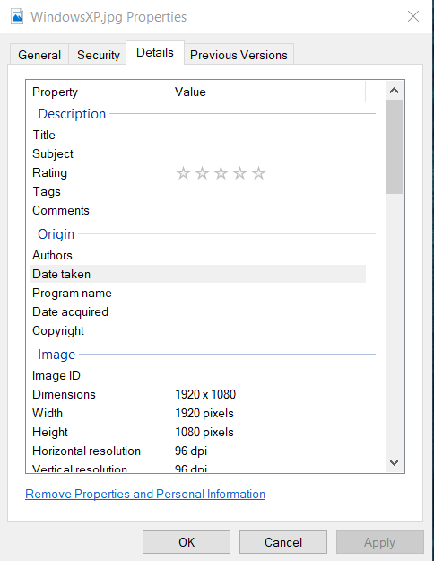
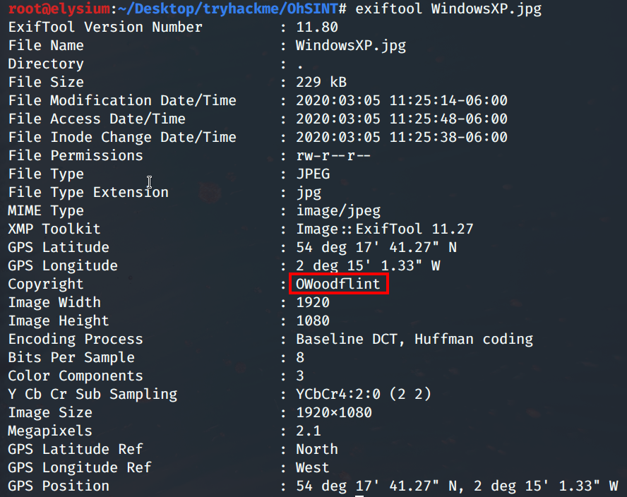
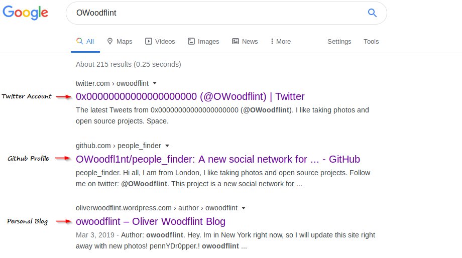
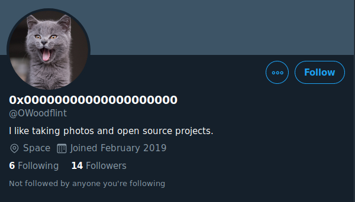
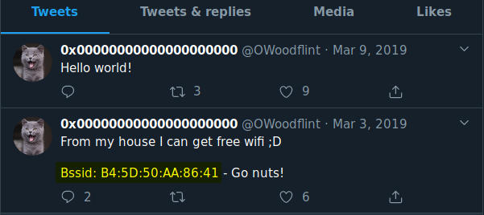
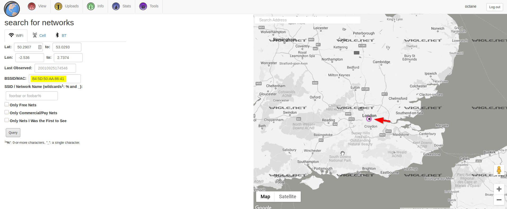
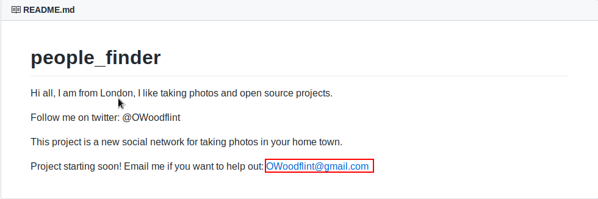
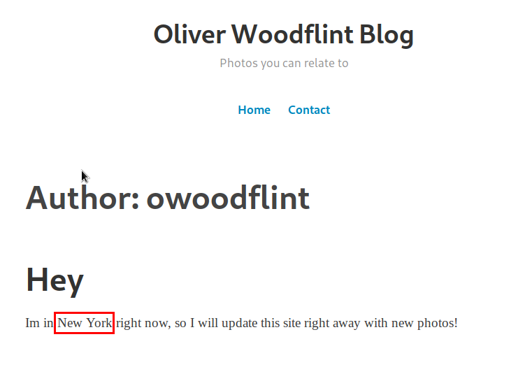
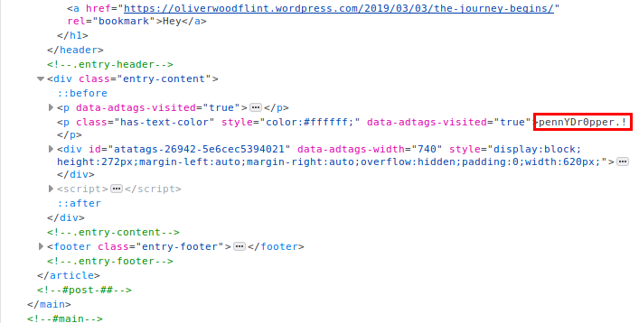

## Introduction

The OhSINT room on [TryHackMe.com](http://tryhackme.com) focuses on finding information from a regular .JPG image and then escalate to discover critical data using OSINT (Open-Source Intelligence). This is a good hands-on experience for beginners who are looking to explore OSINT,Penetration Testing and Bug Bounties. 

Room URL : [https://tryhackme.com/room/ohsint](https://tryhackme.com/room/ohsint)

## Resources Used

- exiftool [[https://www.poftut.com/how-to-install-and-use-exiftool-in-linux-windows-kali-ubuntu-mint-with-examples/](https://www.poftut.com/how-to-install-and-use-exiftool-in-linux-windows-kali-ubuntu-mint-with-examples/)]
- [Wigle.net](http://wigle.net/)
- Kali VM

## WriteUp

The challenge provides an image to be downloaded. Opening the image in an image viewer does not reveal anything special. A quick to-do when exploring images is to check for its metadata. 

### What is Metadata?

Image metadata is text information related to an image file that is usually attached to the file. It includes details relevant to the image. These attached information can be EXIF files, IPTC files, 8BIM files or ICC files. 

EXIF files hold dozens of details which can be valuable to an OSINT investigator. It can have information such as,

- when the picture was taken,
- where it was taken,
- the shutter speed,
- the owner of the image,

and so on. 

### Exploring EXIF data

Simply, the EXIF data can be observed by checking out the Properties of the Image and navigating to the Details Panel.

This provides trivial information, but does not paint the complete picture. More can be dug up using **exiftool.** Exiftool is powerful command-line application for reading, writing and editing meta information in a wide variety of files.

Let's observe the image with exiftool. 

Aha! It is clear that someone holds copyright on this image, OWoodflint. It hints to be an username. The next step is to find if there is any information on the internet about "OWoodflint". Investigation continues! 

## Google Dorking

Query "OWoodflint" on google or on any search engine and try to gather meaningful data. 

3 leads have been discovered connected to this username. The Twitter account reveals the answer to the 1st question of the challenge. The user's avatar is a **cat**.

The next question asks for the user's city. Examining the twitter account does not reveal anything about a location. Is that right? Look again. 

### Identifying WAPs

BSSID is an unique address given to a Wireless Access Point (WAP) to recognize it. It is similar to a MAC address on a PC. Lucky for us, there are websites for collecting information about the different wireless hotspots around the world. These hotspots can be identified using SSID, GPS coordinates and BSSID. 

> To use [wigle.net](http://wigle.net), an account should be created.

Searching for OWoodflint's BSSID points us the user's location which is **London**. Another question solved!

The 3rd question asks us for the SSID. SSID is a customizable name given to a WAP. Zooming in on the marker discloses the SSID of OWoodflint's WiFi as **UnileverWiFi.** 

### Further Investigation

It's time to explore the other search results (i.e the GitHub page and the Blog). The user's personal email address can be found in the [README.md](http://readme.md) file in their GitHub repository.

The next task is to find out this user's holiday location. Conveniently, the user has disclosed this in their blog. 

I hope they had a great experience at **New York**. The final task is to find OWoodflint's password. It is a bit trickier. After going through the pages again and again, searching endlessly for the password, it was placed in a basic location; the blog's source code! 

Press F12 and inspect the source code of the blog. A weird pattern of text appears, and that is the password. To the user's defense,it qualifies as a good password but sadly placed at the wrong location. Seriously, OWoodflint, use a password manager!

 

## Final Thoughts

As I mentioned at the start, this room is perfect for beginners looking to up their game at OSINT. I will be trying other rooms at TryHackMe and posting my writeups too. So watch out this space for more awesome content. 

---

If you like my content, let me know on Twitter : [https://twitter.com/swsjona](https://twitter.com/swsjona)

F**urther reading on terms and concepts mentioned in my writeup.** 

[An Overview of Image Metadata - How It Affects Web Performance and Security - KeyCDN](https://www.keycdn.com/blog/image-metadata)

[What is a BSSID?](https://www.speedcheck.org/wiki/bssid/#service-set-identifier-(ssid))

[WiGLE](https://en.wikipedia.org/wiki/WiGLE)